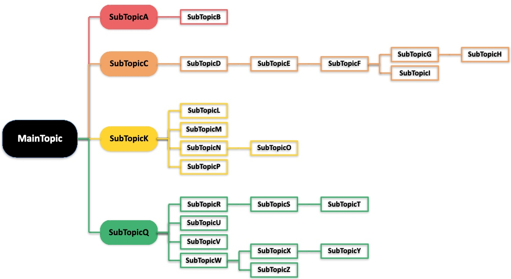
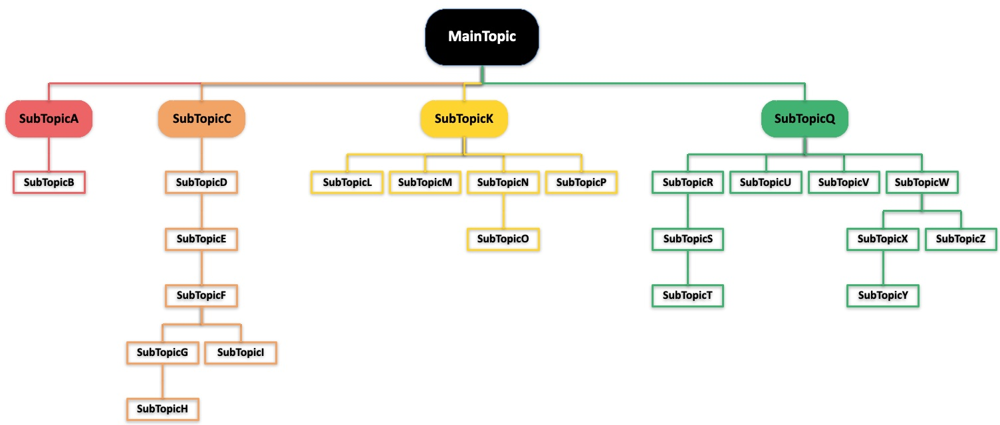

   #### Note: The first level of indentation is used to define the hierarchy of the mind map.
   #### And there is only one level of MainTopic.
   ```markdown
      - MainTopic    
      - SubTopicA
            - SubTopicB
      - SubTopicC
            - SubTopicD
                  - SubTopicE
                  - SubTopicF
                        - SubTopicG
                              - SubTopicH
                        - SubTopicI
      - SubTopicK
            - SubTopicL
            - SubTopicM
            - SubTopicN
                  - SubTopicO
            - SubTopicP
      - SubTopicQ
            - SubTopicR
                  - SubTopicS
                  - SubTopicT
            - SubTopicU
            - SubTopicV
            - SubTopicW
                  - SubTopicX
                  - SubTopicY
                  - SubTopicZ
   ```
   
   
